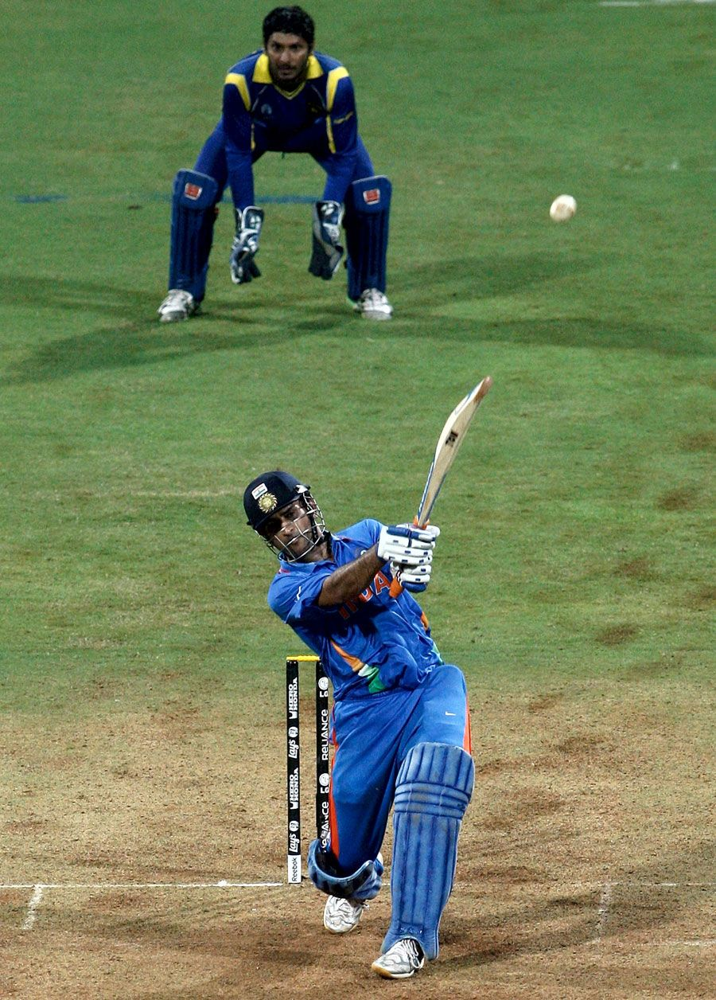

# STRIKE - Cricket Fantasy Platform 🏏

<div align="center">
  
  <p><em>Your Ultimate Fantasy Cricket Experience</em></p>
</div>

[](https://www.typescriptlang.org/)
[](https://reactjs.org/)
[](https://tailwindcss.com/)
[](https://vitejs.dev/)
[](https://supabase.io/)

## 📱 Overview

Strike is a next-generation fantasy cricket platform where fans can create teams, join contests, track live matches, and even collect NFTs of their favorite players. With a sleek UI and comprehensive stats, Strike brings cricket fantasy gaming to a whole new level.

## ✨ Features

- **🏆 Fantasy Contests**: Create teams and compete with other fans
- **🎮 Live Match Tracking**: Follow match progress in real-time
- **👨‍🦱 Player Profiles**: Detailed stats for all your favorite cricketers
- **🎖️ NFT Marketplace**: Collect and trade digital player cards
- **👛 Digital Wallet**: Manage your earnings securely
- **🔐 User Authentication**: Secure login/signup system

## 🖥️ Tech Stack

- **Frontend**: React 18, TypeScript
- **Styling**: Tailwind CSS, shadcn/ui components
- **Build Tool**: Vite
- **Backend**: Supabase
- **State Management**: React Context API & React Query
- **Routing**: React Router
- **Form Handling**: React Hook Form with Zod validation
- **Charts**: Recharts

## 🚀 Getting Started

### Prerequisites

- Node.js (v16+)
- npm or Bun

### Installation

```bash
# Clone the repository
git clone <YOUR_REPO_URL>

# Navigate to the project directory
cd strike

# Install dependencies
npm install
# or
bun install

# Start the development server
npm run dev
# or
bun dev
```

The app will be available at [http://localhost:5173](http://localhost:5173)

## 📂 Project Structure

```
├── public/               # Static assets
│   ├── players/          # Player images
│   └── team_logos/       # Team logos
├── src/
│   ├── components/       # UI components
│   │   ├── cricket/      # Cricket-specific components
│   │   ├── layout/       # Layout components
│   │   └── ui/           # shadcn/ui components
│   ├── contexts/         # React contexts
│   ├── data/             # Mock data and API responses
│   ├── hooks/            # Custom React hooks
│   ├── integrations/     # Third-party integrations
│   ├── lib/              # Utility functions
│   ├── pages/            # Page components
│   └── services/         # API service layers
└── supabase/             # Supabase configurations
```

## 🤝 Contributing

1. Fork the repository
2. Create your feature branch (`git checkout -b feature/amazing-feature`)
3. Commit your changes (`git commit -m 'Add some amazing feature'`)
4. Push to the branch (`git push origin feature/amazing-feature`)
5. Open a Pull Request

## 📄 License

This project is licensed under the MIT License - see the LICENSE file for details.

## 📞 Contact

Project Link: [https://github.com/yourusername/strike](https://github.com/yourusername/strike)

---

<div align="center">
  <p>Made with ❤️ by the Strike Team</p>
</div>
